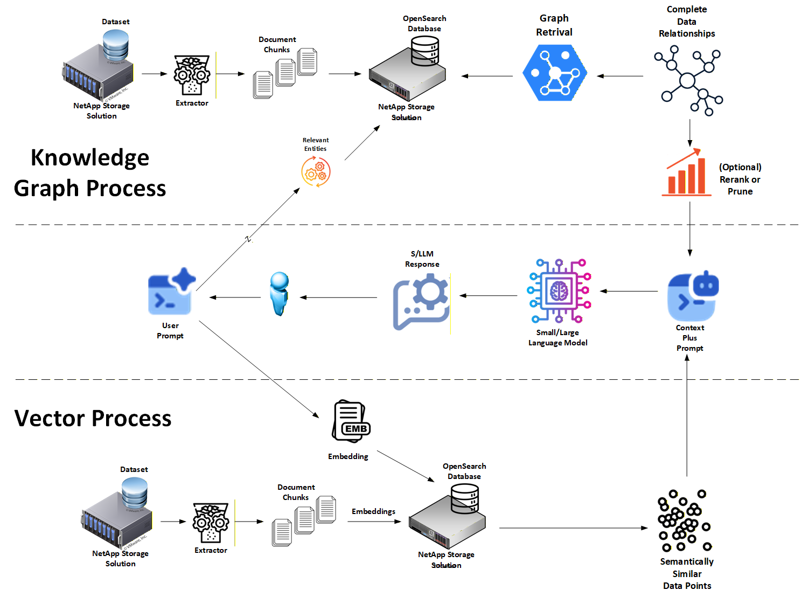

# Hybrid RAG: Open Source Community Version

Most RAG stacks start with vectors and end with questions from auditors: *why did that snippet surface, which facts mattered, and can we reproduce the response tomorrow?* Graph-based Hybrid RAG flips the playbook. We begin with a **Knowledge Graph** for truth grounding so retrieval is explicit, auditable, and grounded in **entities + relationships** you can inspect, then augment with **dense vector retrieval** where it improves semantic context.

This community implementation uses **two databases**:

- **Neo4j** for **graph truth grounding** (entities, chunks, document structure, and "mentions" links).
- **OpenSearch** for **vector semantic context** (k-NN over chunk embeddings).

**Why graph-first beats black-box vectors**

- **Explainability on day one:** Facts are stored as **entities and relationships** (nodes + edges) with provenance. You can point to the exact grounded evidence. No hand-waving about "semantic neighbors" or "vector math".
- **Governable retrieval:** Graph grounding uses explicit structures: entity matches, neighborhood expansion, and traceable evidence sets (subgraphs).
- **Reduce hallucinations without hiding the ball:** Answers are grounded in retrieved graph facts with metadata, and every claim traces back to source evidence. Vectors are additive context, not the authority.

**How this stack works**

At ingest, an external extraction pipeline (NER) turns documents into:

- **Graph facts (Neo4j):** documents + chunks + entities + relationships needed for deterministic grounding.
- **Vector chunks (OpenSearch):** paragraph (or chunk) embeddings for semantic retrieval.

In the search path, we pair **graph grounding** with **vector semantic support**:

1. **Graph grounding (entity-aware, Neo4j):** When a question yields entities, retrieval anchors on matching nodes and pulls a compact evidence subgraph (relevant chunks and mentions) so "why it matched" stays painfully clear.
2. **Vector semantic support (OpenSearch k-NN):** We run k-NN search over the vector chunk index to capture related phrasing and supporting explanation, typically filtered to graph-anchored docs to reduce semantic drift.

If **no** entities are detected (or the graph evidence is sparse), the system falls back to vector retrieval for recall and uses any available structured signals (document metadata, extracted concepts) to keep context relevant. Factual claims still must be grounded in explicit evidence.

**LLM answering (ground → refine)**

The response flow uses two explicit prompts:

1. **Grounding pass (`build_grounding_prompt`)**: the LLM receives only **graph evidence** and must cite every factual sentence using graph evidence tags. If the evidence is insufficient, it must say so.
2. **Refinement pass (`build_refine_prompt`)**: the LLM rewrites the grounded draft for clarity. It must preserve all graph citations verbatim and may add brief, non-factual clarifications supported by vector context. Vector citations are additive and never replace graph grounding.

This split keeps truth anchored to structured evidence while allowing semantic context to improve readability.

The retrieval layer also respects a **HOT store** (user-specific, fast-changing data) and a **long-term store** (curated data) in parallel, then merges and de-duplicates evidence before handing results to the LLM.

**Dual-store design (HOT vs. Long) with Graph + Vector**

| Layer                    | Where it lives                                                | What it stores                                                                 | Why it matters                                                                 |
| ------------------------ | ------------------------------------------------------------- | ------------------------------------------------------------------------------ | ------------------------------------------------------------------------------ |
| **Long-term (LT)**       | **Neo4j** (LT graph) + **OpenSearch** (LT vector index)        | Curated, vetted facts (graph evidence) + stable vector chunks                  | Authoritative source with provenance; ideal for compliance and audits          |
| **HOT (unstable) cache** | **Neo4j** (HOT graph) | User-specific/session-scoped facts + live/unvetted graph evidence + fresh chunks | Isolates blast radius and policy; natural place to enforce TTLs and test facts |

Promotion is **explicit and outside the query path**: the retrieval code queries **LT and HOT in parallel** (read-only). Moving data **from HOT to LT** occurs **only** when there's sufficient positive reinforcement of the facts *or* a trusted human-in-the-loop has verified them.

**Business impact**

- **Transparency & accountability:** Each answer can include a compact **evidence subgraph** (entities + links to source chunks) with provenance.
- **Compliance by design:** Clear lifecycles (**HOT TTL** vs. long-term retention) simplify GDPR/HIPAA-style obligations.
- **Lower risk, higher signal:** Graph grounding reduces fabrication while keeping vectors as a **declared, supporting channel** rather than a hidden default.
- **Safer generation:** The two-pass LLM design isolates factual grounding from stylistic refinement, which makes audits simpler and mitigates semantic drift.

The sections that follow show how to **ingest** into Neo4j with provenance-friendly metadata plus vector embeddings in OpenSearch, **retrieve** with entity-aware graph grounding and vector augmentation, and **operate LT ↔ HOT promotion workflows** (outside the query path) with optional TTL policies and observability hooks that make auditors less cranky.

## 1. Ingesting Your Data Into Long-Term Memory

### Why We Start With Deterministic Graph Construction

Long-term memory is the system's **source of truth**. Every document that lands here must be clean, auditable, and ready for governance. That means stable identifiers, consistent extraction rules, and provenance on every stored fact.

The ingestion pipeline does these things in a single pass:

1. **Parses raw text** from articles, manuals, or tickets.
2. **Attaches metadata + stable IDs** (`category` from the parent folder; stable `doc_id` from the file path under `DATA_DIR`).
3. **Extracts entities** via an extraction service (NER).
4. **Persists graph structure** into **Neo4j**:
   - documents and their chunks
   - entities
   - "mentions" links between chunks and entities
5. **Generates vector embeddings** for overlapping chunks.
6. **Persists embeddings** into **OpenSearch** as a k-NN vector index.

Do this well once, and every downstream RAG query inherits the same deterministic, audit-friendly provenance.

### Pipeline at a Glance

The reference ingest flow makes it concrete:

- Documents are read from disk, `category` is derived from the folder, and the full file body becomes the extraction input.
- Entities are **normalized** (lower-cased, de-duplicated, optionally canonicalized).
- Neo4j gets:
  - `(:Document {store, path, category, ...})`
  - `(:Chunk {store, doc_path, chunk_index, chunk_count, text, ...})`
  - `(:Entity {name})`
  - `(Document)-[:HAS_CHUNK]->(Chunk)`
  - `(Chunk)-[:MENTIONS]->(Entity)`
- OpenSearch gets paragraph-level chunks embedded into a k-NN index, with stable IDs + provenance metadata (`doc_id`, `filepath`, `chunk_id`, timestamps, etc.).

Repeat runs upsert by stable `doc_id` (derived from file path), updating version/timestamps.

### Paragraph-level chunking in practice

Chunking is the default retrieval unit for semantic support: vector retrieval returns small spans, not full documents.

Graph evidence is chunk-aware too: chunks are first-class nodes in Neo4j, which means grounding can retrieve *exactly which spans* mention the query entities, optionally expanding to neighboring chunks for local context.

The governance contract is:

- **Graph evidence (Neo4j)** remains traceable to source documents/chunks.
- **Vector context (OpenSearch)** remains traceable to the same sources and does not replace grounding.

### Step-by-Step Walkthrough

| Stage                         | What happens                                                                           | Code cue (conceptual)                      |
| ----------------------------- | -------------------------------------------------------------------------------------- | ------------------------------------------ |
| **1. Bootstrap schema**       | Ensure Neo4j constraints / indexes exist (doc IDs, entity keys, store tags).           | `ensure_graph_schema()`                    |
| **2. Walk the dataset**       | For every `.txt` file, derive `category` from folder.                                  | `glob(DATA_DIR/*/*.txt)`                   |
| **3. Read text**              | Raw file body stored as ingest input metadata.                                         | `p.read_text()`                            |
| **4. Call NER**               | POST text to NER endpoint; receive entities.                                           | `post_ner()`                               |
| **5. Normalize entities**     | Lowercase + dedupe; optional alias/canonical mapping.                                  | `normalize_entities()`                     |
| **6. Upsert Neo4j nodes**     | Insert/update documents + chunks + entities + mentions with provenance tags.           | graph upsert helpers                       |
| **7. Generate embeddings**    | Embed paragraph chunks for semantic lookup.                                            | embedding abstraction                      |
| **8. Index OpenSearch**       | Store vector chunks with stable IDs + provenance metadata for k-NN retrieval.          | OpenSearch indexing helpers                |
| **9. Logs for observability** | Print ingest counts: files processed, entities extracted, chunks indexed, errors, etc. | logger                                     |

### Operational Knobs You Control

| Setting / variable (typical)                 | Purpose                                                               |
| -------------------------------------------- | --------------------------------------------------------------------- |
| `DATA_DIR`                                    | Root directory of raw `.txt` files (organized by category).           |
| `NEO4J_URI`, `NEO4J_USER`, `NEO4J_PASSWORD`   | Neo4j connection details for graph grounding.                         |
| `OPENSEARCH_HOST`, `OPENSEARCH_USER`, `OPENSEARCH_PASSWORD` | OpenSearch connection details for vector retrieval.         |
| `VECTOR_INDEX_NAME`                           | Name of the OpenSearch vector index to create/target.                 |
| `EMBED_MODEL_NAME`                            | Sentence-transformers model name for embeddings.                      |
| `NER_URL`                                     | Endpoint for the NER/extraction service.                              |
| `CHUNK_SIZE`, `CHUNK_OVERLAP`                 | Chunking behavior for indexing and retrieval alignment.               |

> In the community stack, extraction is treated as required by default. If you want fail-soft behavior, catch extractor errors and allow vector-only ingestion while the extractor is down.

### Implementation Considerations

For governance, deploy a **domain-trained** extractor (product codes, regulation IDs, case numbers, etc.). The core auditability comes from:

- deterministic Neo4j schema (stable doc IDs, chunk indices, store tags),
- explicit entity normalization rules,
- provenance fields on stored records (timestamps, versions, source paths),
- and OpenSearch chunk metadata aligned to the same provenance contract.

If you later want per-fact audit fields (extractor version, confidence thresholds), add them as node/edge properties so evidence is self-describing.

## 2. Reinforcement & Data Promotion (HOT → Long)

### Why a feedback loop matters

Reinforcement learning (RL) data contained in HOT would let high-value items **graduate** to long-term (LT). In the **community reference code**, we **do not** mutate LT based on HOT activity. LT remains the authoritative store; HOT is a governed cache that warms via entity-based promotion and **evicts by TTL**.

If you later enable HOT → LT, do it as an explicit workflow with defined criteria.

### Signals and scoring (graph-grounded style)

There is **no in-graph confidence scoring** in the reference implementation.

What we actually track today:

- `hot_promoted_at` (epoch millis) on HOT records written during promotion (graph and optional vector cache).
- Optional app-level metrics (outside the databases) if you log cache hits or human reviews.
- Eviction is driven by time (TTL), not by a score.

If you need scores later, store them **out-of-band** (analytics DB) and keep long-term facts unchanged.

### Promotion workflow

| Stage                   | Trigger                                  | Action                                                                                                                        |
| ----------------------- | ---------------------------------------- | ----------------------------------------------------------------------------------------------------------------------------- |
| **1. Cache write**      | App detects entities via extraction       | A **HOT-side promotion job** copies relevant LT evidence into HOT using an entity filter; sets `hot_promoted_at`.            |
| **2. Serve results**    | Subsequent queries                        | Retrieval queries **LT and HOT in parallel**; strictness enforced at query time in Neo4j grounding logic.                    |
| **3. Evict**            | `hot_promoted_at` older than TTL          | A scheduled deletion removes expired HOT graph evidence (and optional HOT vector chunks).                                    |
| **4. Promote HOT → LT** | Sufficient reinforcement **or** human OK  | Only then copy into LT (explicit, audited job). The reference code does **not** implement this step automatically.          |
| **5. Audit**            | After promotion/eviction                  | Evidence comes from promotion job outputs, `hot_promoted_at`, and eviction job outputs.                                       |

### Code cues (Python)

**Evict expired HOT facts by TTL (matches community intent)**

The reference workflow uses a scheduled deletion against the HOT store for items whose `hot_promoted_at` is older than the configured TTL. Promotion is executed by a **HOT-side job** that pulls a subgraph from LT based on entities.

### Tunables you should expose

| Variable / setting             | What it controls                                                              |
| ------------------------------ | ----------------------------------------------------------------------------- |
| `TTL_MINUTES`                  | Lifetime of HOT facts before time-based deletion.                             |
| `PROMOTE_MAX_CHUNKS` / budgets | Caps evidence size pulled into HOT per promotion run.                         |
| `PROMOTE_HOPS`                 | Neighborhood depth (1-hop vs 2-hop expansion) during promotion.               |
| `PROMOTE_WINDOW_SECONDS`       | Optional recency filter during promotion (based on ingest timestamps).        |
| `HOT_ENABLED`                  | Whether to query HOT alongside LT.                                            |
| `VECTOR_FILTER_TO_GRAPH`       | Whether OpenSearch k-NN retrieval is filtered to graph-anchored doc IDs.      |

### Governance & safety wins

- **Authoritative remains authoritative.** HOT never overwrites LT automatically.
- **Deterministic lifecycle.** Promotion is explicit (job output + `hot_promoted_at`); eviction is explicit (TTL query).
- **Explainable path.** You can show the exact entity filter and expansion logic that warmed HOT and the outputs that cleaned it up.

### Field notes

Start with entity-triggered warming and **time-based eviction**. Promotion can be intentionally permissive (OR over entities, shallow hop expansion) while the **final grounding** step remains strict (only cite facts that clearly support the answer). If you later add reinforcement or human approval, keep those signals **outside** LT and promote to LT **only** after sufficient reinforcement **or** trusted human approval.

## 3. Implementation Guide

For a reference, please check out the following: [community_version/README.md](./community_version/README.md)

## 4. Conclusion

Graph-first RAG gives you more than quick answers... it gives you answers you can **defend**.

- **Transparency & explainability** are built-in: explicit graph evidence (Neo4j chunks + entity mentions) with provenance shows *exactly* why a fact was used.
- **Accountability & risk control** improve because grounding is structured (Neo4j), semantic context is additive (OpenSearch k-NN), and promotion/eviction behavior is configured and reproducible.
- **Compliance** turns into an operational posture: a durable long-term store, a TTL-governed **HOT** cache keyed by `hot_promoted_at`, and observable promotion/eviction events.

Pair that with the dual-store layout (**HOT (unstable) cache** for today's topics plus **durable long-term memory** for provenance) and you get a system that's **responsive now** and **auditable later**.

### Your next steps

1. **Run the stack.** Stand up Neo4j + OpenSearch, ingest, then run entity-aware graph retrieval to see evidence in action (with the parallel LT+HOT plan).
2. **Swap the extractor.** Configure the NER service to fit your domain; if you want per-fact audit fields, extend Neo4j properties to include extractor metadata.
3. **Tune hybrid retrieval.** Adjust hop depth, evidence budgets, and vector budgets to balance grounding with semantic reach.
4. **Enable HOT cache (promotion + TTL).** Pull relevant LT evidence into HOT based on entities, stamp `hot_promoted_at`, and schedule TTL eviction. Log validations **out of band**. Promotion **from HOT to LT** happens **only** after sufficient reinforcement **or** trusted human approval.
5. **Share what you learn.** PRs with extraction improvements, relevance sweeps, and governance playbooks make the ecosystem better.

Graph-grounded RAG isn't a thought experiment; it's running code with clear governance wins. Spin it up, measure it, and raise the bar for responsible retrieval.
